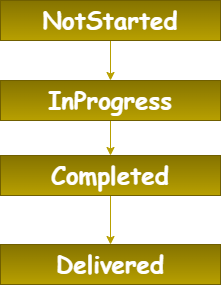

# 💡 How It Works

Before we get started we should get a broad idea on how does the quest system work.

The quest system has multiple classes however the ones you should be aware are the following

## 🗺️ Quest
A quest is a piece of data that contains all the information for a quest. This includes information such as the name, description, quest chains and most importantly the objectives that are required to complete for this quest to be complete.

It's also important to understand that a quest has multiple states from: NotStarted, InProgress, Completed and Delivered.



We will go further in detail about what we are capable of doing with a Quest Object as we progress on the Docs

### 🆚 Completed vs Delivered
Some people might get confused when seeing this lifecycle wondering what it is the difference between completed and delivered.

Imagine you're playing an MMO RPG and have a quest giver. Once you complete this quest you'll need to go back to this NPC and tell him that your job is done. Until you inform the NPC about the quest status the quest will remain as Completed and then finally will be changed to Delivered.

"But what if I don't want my players to deliver the quest in my game?" Simple! There's a setting that you can modify while creating a new quest that makes quests move automatically from Completed to Delivered. (more information on that on the [Automatic vs Manual Section](./../AutomaticVsManual/AcceptType.md))

## 🎯 Objective
Objectives are really what keeps the quests running. On the high-level an objective is a task a player needs to complete X amounts of time. Each quest can have multiple objectives and all of these will need to be completed in order to complete the quest.

Imagine it as an integer that you need to increase until it reaches a target value.

```
E.g
0/2 Apples Collected
1/2 Apples Colleted
2/2 Apples Collected - Fires as completed
```

## ❤️ LifeCycle

An example how the quest system functions when a player grabs an apple that is required for his quest:

