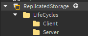

# ♻️ Creating LifeCycle

## 🪜 Create Stairs

Now that we have a base understanding of a lifecycle let's take a look at it in action! 

For this example we'll make an object that is too high for the player to collect! However whenever the player accepts the quest stairs spawn in! These stairs will allow the player to climb up and get the object!

Remember the apple quest from the earlier sections? We'll be using that for this one too! Let's start by creating a platform and some stairs...


Make sure to keep the stairs as their own model!

## 📂 Create Folder Structure

For me this is one of the most important steps to take into account! We want to make sure that we have a good place to store our lifeCycles. The following example is my personal recommendation but feel free to store lifecycles as you please!



##  💖 Create LifeCycle

Now let's make the lifecycle! Since we only want to display the stairs for 1 player we'll create this lifecycle on the client folder! Here's an example:

```lua
local ReplicatedStorage = game:GetService("ReplicatedStorage")

local RoQuest = require(ReplicatedStorage.RoQuest).Client

local QuestLifeCycle = RoQuest.QuestLifeCycle {
	Name = "AppleLifeCycle" -- Important unique identifier
}

function QuestLifeCycle:OnInit() -- Called when the player joins
	self.stairs = workspace.Stairs
	self.stairs.Parent = ReplicatedStorage
end

function QuestLifeCycle:OnStart()
	self.stairs.Parent = workspace
end

function QuestLifeCycle:OnDeliver()
	self.stairs.Parent = ReplicatedStorage
end

return QuestLifeCycle
```

## 🔧 Setup Lifecycle

Now that we created our lifecycle we need to connect it to the quest we wish

```lua
local ReplicatedStorage = game:GetService("ReplicatedStorage")

local RoQuest = require(ReplicatedStorage.RoQuest).Server
local appleObjective = require(ReplicatedStorage.QuestObjectives.AppleInfo)

local Quest = RoQuest.Quest

return Quest {
	Name = "Collect Apples",
	Description = "Collect 2 apples",
	QuestId = "AppleCollection", 
	LifeCycles = {"AppleQuest"}, -- The lifecycles that will manage this quest's behavior
	QuestObjectives = {
		appleObjective:NewObjective(2)
	}, 
}
```

## ⌛ Load LifeCycles

:::info

Please remember that lifecycles need to be loaded in **both** the client and server

:::

```lua
-- Server
local ReplicatedStorage = game:GetService("ReplicatedStorage")
local DataStoreService = game:GetService("DataStoreService")
local Players = game:GetService("Players")

local RoQuest = require(ReplicatedStorage.RoQuest).Server

local questsStore = DataStoreService:GetDataStore("PlayerQuests")

RoQuest:Init(RoQuest:LoadDirectory(ReplicatedStorage.Quests), RoQuest:LoadDirectory(ReplicatedStorage.LifeCycles.Server))
```

```lua
-- Client
local ReplicatedStorage = game:GetService("ReplicatedStorage")

local RoQuest = require(ReplicatedStorage.RoQuest).Client

RoQuest:Init(RoQuest:LoadDirectory(ReplicatedStorage.LifeCycles.Client))
```