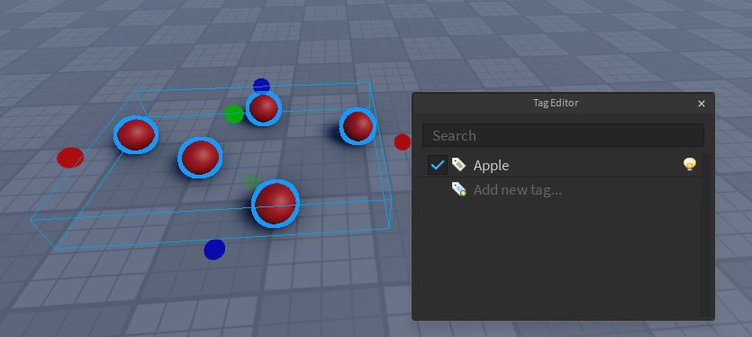

# 🍎 Creating Object

Now we'll be creating the apple that the player needs to collect in order to complete the quest. 

Let's keep this very simple for the sake of the example. All we'll do is an apple that you collect by triggering a proximity prompt. We'll also make sure the apple respawns so that we can pick them up multiple times.

## 🍎 Creating the Apple

Let's create a few red balls. Make sure to anchor them and then add them a tag called **"Apple"**



## 💻 Code
Great, now that we have out apples we need to create their code. Here's an example of a code I did that allows us to collect the apples. I made this code its own server script under ServerScriptService

```lua
local ReplicatedStorage = game:GetService("ReplicatedStorage")
local CollectionService = game:GetService("CollectionService")

local RoQuest = require(ReplicatedStorage.RoQuest).Server

local function appleAdded(apple)
	local clone = apple:Clone()
	local proximityPrompt = Instance.new("ProximityPrompt")
	proximityPrompt.ActionText = "Collect Apple"
	proximityPrompt.HoldDuration = 0.25
	
	proximityPrompt.Triggered:Connect(function(player)
		apple:Destroy()
		
		RoQuest:AddObjective(player, "Apple", 1) -- Add to the quest
		
		task.delay(5, function() -- Respawn after 5 seconds
			clone.Parent = workspace
		end)
	end)
	
	proximityPrompt.Parent = apple
end

CollectionService:GetInstanceAddedSignal("Apple"):Connect(appleAdded)

for _, apple in CollectionService:GetTagged("Apple") do
	appleAdded(apple)
end
```

I know this is a lot to digest but the only part you really need to look into is inside the proximityPrompt.Triggered. As you can see we called 

``RoQuest:AddObjective(player, "Apple", 1)``

What this function does is tell our quest system that hey the player just collected an apple, try to add to his quests 1 of apple! But wait, we still didn't tell our system that the quest requires you to collect apples in order to be complete!