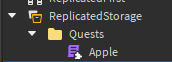

# ✍️ Declaring Quest

In this section we'll be learning how to create quests and feed them into the system

## 📐 Structure

My recommendation when creating quests is to create a folder called Quests. It will be in this folder that we store all our quests in their own Module Scripts. 

Start by creating a folder and inside of it create a quest called Apple



## 👀 Example

```lua
-- Apple.lua

local ReplicatedStorage = game:GetService("ReplicatedStorage")

local RoQuest = require(ReplicatedStorage.RoQuest).Server
local Quest = RoQuest.Quest

return Quest {
	Name = "Collect Apples", -- The name of our quest
	Description = "Collect 2 apples", -- The description that we will display to our user
	QuestId = "AppleCollection", -- A unique identifier to our quest
	QuestAcceptType = RoQuest.QuestAcceptType.Automatic, -- If the quest automatically gets accepted or rquires manual work
	QuestDeliverType = RoQuest.QuestDeliverType.Automatic, -- If the quest automatically gets delivered or requires manual work
	QuestRepeatableType = RoQuest.QuestRepeatableType.NonRepeatable, -- If the quest can be repeated or not
	QuestStart = -1, -- UTC time to define when the quest should become available (specially useful for event quests)
	QuestEnd = -1, -- UTC time to define when the quest should no longer be available (specially useful for event quests)
	RequiredQuests = {}, -- A list of quests that are required to be delivered before this quest can be started
	LifeCycles = {}, -- The lifecycles that will manage this quest's behavior
	QuestObjectives = {}, 
}
```