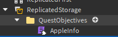

# 🎯 Quest Objectives
Quest Objectives are the goals of our quest. They determine what the player needs to complete in order to progress in his quest. Here we will be creating an objective of collecting X apples. This will allow us to tell our quest that the player needs to get apples in order to complete the quest!

## 📐 Structure

My recommendation, similar to quests, is to create a folder for Quest Objectives. Let's create this folder under ReplicatedStorage and add a new ModuleScript in called AppleInfo.



## 👀 Example

```lua
-- AppleObjective.lua
local ReplicatedStorage = game:GetService("ReplicatedStorage")

local RoQuest = require(ReplicatedStorage.RoQuest).Server

local ObjectiveInfo = RoQuest.ObjectiveInfo

return ObjectiveInfo.new {
	Description = "%s/%s apples collected", -- This is the description, the %s's refer to the current progress and goal progress
	Name = "Collect Apples", -- The name of our objective
	ObjectiveId = "Apple", -- A unique identifier to this objective
}
```

Please keep in mind that the ObjectiveId is what you'll use as a reference when setting the progress for this objective