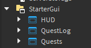
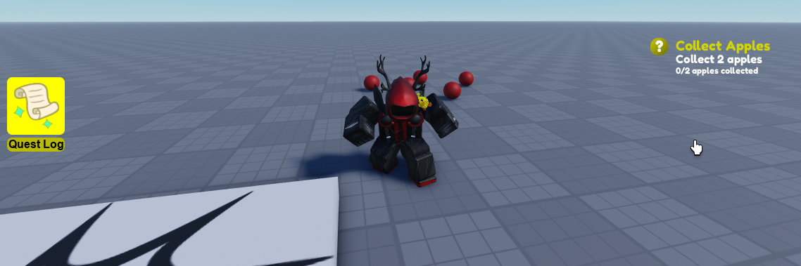

# 🖥️ Making Quest UI

## 🖥️ Import UI

In order to make this tutorial easier to follow I'll provide some assets to create our first UI! Please install them here and import them into your StarterGui:

https://create.roblox.com/store/asset/17477286969




## 👀 Example

```lua
local Players = game:GetService("Players")
local ReplicatedStorage = game:GetService("ReplicatedStorage")

local RoQuest = require(ReplicatedStorage.RoQuest).Client

type Quest = RoQuest.Quest
type QuestObjective = RoQuest.QuestObjective

local QuestStatus = RoQuest.QuestStatus

local localPlayer: Player = Players.LocalPlayer
local playerGui: PlayerGui = localPlayer:WaitForChild("PlayerGui")
local scrollingFrame: ScrollingFrame = playerGui:WaitForChild("Quests"):WaitForChild("Main"):WaitForChild("ScrollingFrame")
local template: Frame = scrollingFrame:WaitForChild("Template")
local clone = template:Clone()
template:Destroy()
template = clone

local Quests = {}

function Quests:UpdateObjective(quest: Quest, objectiveId: string, newValue: number)
	local existingFrame: Frame? = scrollingFrame:FindFirstChild(quest.QuestId)

	if not existingFrame then
		return
	end

	local objectivesWindow: Frame = existingFrame.TextContainer.Objectives
	local objectiveText: TextLabel? = objectivesWindow:FindFirstChild(objectiveId)

	if not objectiveText then
		return
	end

	local questObjective: QuestObjective = quest:GetQuestObjective(objectiveId)

	objectiveText.Text = string.format(questObjective:GetDescription(), newValue, questObjective:GetTargetProgress())
end

function Quests:UpdateQuestFrame(quest: Quest, frame: Frame)
	local textContainer: Frame = frame:WaitForChild("TextContainer")

	if quest:GetQuestStatus() == QuestStatus.Completed then
		textContainer.Description.Text = "Read to deliver!"
	elseif quest:GetQuestStatus() == QuestStatus.Delivered then
		frame:Destroy()
	else
		textContainer.Title.Text = quest.Name
		textContainer.Description.Text = quest.Description
	end
end

function Quests:UpdateInterface()
	local quests: {[string]: Quest} = RoQuest:GetInProgressQuests()

	for _, instance: Instance in scrollingFrame:GetChildren() do -- Delete quests that dont exit
		if instance:IsA("Frame") and not quests[instance.Name] then
			instance:Destroy()
		end
	end

	for questId: string, quest: Quest in quests do
		local existingFrame: Frame = scrollingFrame:FindFirstChild(questId)

		if existingFrame then
			self:UpdateQuestFrame(quest, existingFrame)
			continue -- Quest already exists
		end

		local newTemplate: Frame = template:Clone()
		newTemplate.Name = questId
		local textContainer: Frame = newTemplate:WaitForChild("TextContainer")
		textContainer.Title.Text = quest.Name
		textContainer.Description.Text = quest.Description
		local objectives: Frame = textContainer:WaitForChild("Objectives")

		for _, questObjective: QuestObjective in quest:GetQuestObjectives() do
			local objectiveTemplate: TextLabel = textContainer.Description:Clone()
			objectiveTemplate.Name = questObjective:GetObjectiveId()
			objectiveTemplate.TextSize = 14
			objectiveTemplate.Text = string.format(questObjective:GetDescription(), questObjective:Get(), questObjective:GetTargetProgress())
			objectiveTemplate.Parent = objectives
		end

		newTemplate.Parent = scrollingFrame
		self:UpdateQuestFrame(quest, newTemplate)
	end
end

RoQuest.OnStart():andThen(function()
	RoQuest.OnInProgressQuestChanged:Connect(function()
		Quests:UpdateInterface()
	end)

	RoQuest.OnQuestObjectiveChanged:Connect(function(questId: string, objectiveId: string, newValue: number)
		Quests:UpdateObjective(RoQuest:GetQuest(questId), objectiveId, newValue)
	end)
	
	RoQuest.OnPlayerDataChanged:Connect(function()
		Quests:UpdateInterface()
	end) -- Hard reset our screens  

	Quests:UpdateInterface()
end)
```

The vast majority of this code was just actually setting up the interface UI yet the most important and relevant part is how we gained and updates the data with RoQuest so let's break it down!

## 📥 Getting Data

In RoQuest you can get either all quests or all the quests with a specific state. In order to display the quests that are in progress an easy way to do that would be with the following method:

```lua
local quests: {[string]: Quest} = RoQuest:GetInProgressQuests()
```

This will return all the quests that are currently in progress

## ⚡ Listening to Data

Once we have all of our data set we want to update teh UI under 2 circumstances: when either the data of the quests we're showing changes OR when the quests that are currently in progress change. To do that we can use these 3 events:

```lua
RoQuest.OnInProgressQuestChanged:Connect(function()
    Quests:UpdateInterface()
end)

RoQuest.OnQuestObjectiveChanged:Connect(function(questId: string, objectiveId: string, newValue: number)
    Quests:UpdateObjective(RoQuest:GetQuest(questId), objectiveId, newValue)
end)

RoQuest.OnPlayerDataChanged:Connect(function()
	Quests:UpdateInterface()
end) -- Hard reset our screens  
```

:::warning

And just like we did on the server make sure that you only interact with RoQuest **AFTER** it loaded by using RoQuest.OnStart

:::

