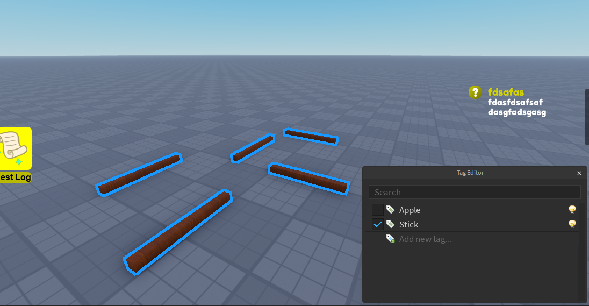

# ♾️ Infinite

Sometimes we want quests to be repeatable. There are multiple types of repeatable quests and here we'll cover examples on all of them. Let's start by making a new quest! This time one where the player needs to collect Sticks!

## 🪵 Creating Sticks

Let's create some sticks and tag them all with a tag called **"Stick"**



## 💻 Code

Great! Now that we have some sticks let's create a new script under ServerScriptService and add the following code:

### 🪵 Make Sticks collectible

Now that we created the sticks we want to make them collectible. For that you can use the following example code:

```lua
--Sticks.lua
local ReplicatedStorage = game:GetService("ReplicatedStorage")
local CollectionService = game:GetService("CollectionService")

local RoQuest = require(ReplicatedStorage.RoQuest).Server

local function stickAdded(stick)
	local clone = stick:Clone()
	local proximityPrompt = Instance.new("ProximityPrompt")
	proximityPrompt.ActionText = "Collect Stick"
	proximityPrompt.HoldDuration = 0.25
	
	proximityPrompt.Triggered:Connect(function(player)
		stick:Destroy()
		
		RoQuest:AddObjective(player, "Stick", 1) -- Add to the quest
		
		task.delay(5, function() -- Respawn after 5 seconds
			clone.Parent = workspace
		end)
	end)
	
	proximityPrompt.Parent = stick
end

CollectionService:GetInstanceAddedSignal("Stick"):Connect(stickAdded)

for _, stick in CollectionService:GetTagged("Stick") do
	stickAdded(stick)
end
```

The main take-away from here is the following function:

``RoQuest:AddObjective(player, "Stick", 1)``

What this function does is tell our quest system that hey the player just collected a stick

### 🎯 Create Quest Objective

Now we need to create the actual quest. To create the actual quest we first need to make the objective required to complete this quest. I'd recommend creating this under ReplicatedStorage in its own folder for quest objectives. Here's an example:

```lua
-- StickInfo.lua
local ReplicatedStorage = game:GetService("ReplicatedStorage")

local RoQuest = require(ReplicatedStorage.RoQuest).Server

local ObjectiveInfo = RoQuest.ObjectiveInfo

return ObjectiveInfo.new {
	Description = "%s/%s sticks collected",
	Name = "Collect Sticks",
	ObjectiveId = "Stick",
}
```

### 📜 Create Quest

And finally we need to create the actual quest object! For this let's make this:

```lua
-- Stick.lua
local ReplicatedStorage = game:GetService("ReplicatedStorage")

local RoQuest = require(ReplicatedStorage.RoQuest).Server
local stickObjective = require(ReplicatedStorage.QuestObjectives.StickInfo)

local Quest = RoQuest.Quest

return Quest {
	Name = "Collect Sticks", -- The name of our quest
	Description = "Collect 3 sticks", -- The description that we will display to our user
	QuestId = "StickCollection", -- A unique identifier to our quest
	QuestAcceptType = RoQuest.QuestAcceptType.Automatic, -- If the quest automatically gets accepted or rquires manual work
	QuestDeliverType = RoQuest.QuestDeliverType.Automatic, -- If the quest automatically gets delivered or requires manual work
	QuestRepeatableType = RoQuest.QuestRepeatableType.Infinite, -- If the quest can be repeated or not
	QuestStart = -1, -- UTC time to define when the quest should become available (specially useful for event quests)
	QuestEnd = -1, -- UTC time to define when the quest should no longer be available (specially useful for event quests)
	RequiredQuests = {}, -- A list of quests that are required to be delivered before this quest can be started
	LifeCycles = {}, -- The lifecycles that will manage this quest's behavior
	QuestObjectives = {
		stickObjective:NewObjective(3)
	}, 
}
```

Please notice that we set the **QuestRepeatableType** to **Infinite**. Now if you hop into the game you can see you can complete this quest an infinite amount of times!